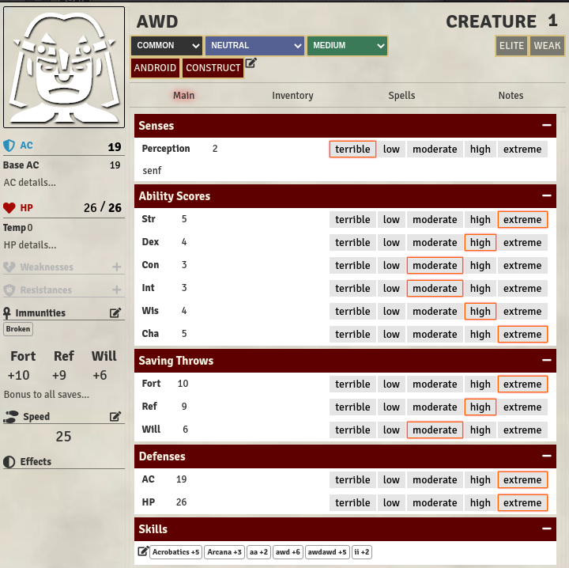
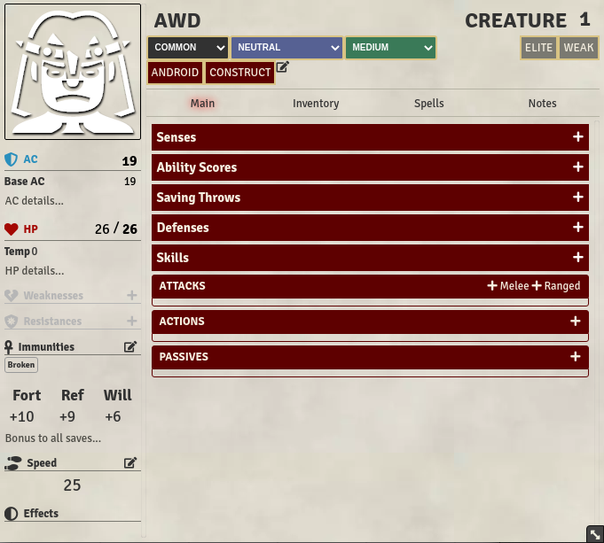
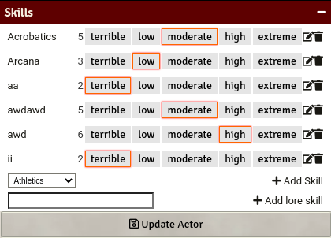

<!--- Downloads @ Latest Badge -->
<!--- replace <user>/<repo> with your username/repository -->
<!---  -->

<!--- Forge Bazaar Install % Badge -->
<!--- replace <your-module-name> with the `name` in your manifest -->
<!---  -->

# Monster Maker

Using the [pathfinder 2e guide on building creatures](https://2e.aonprd.com/Rules.aspx?ID=995)
i created this foundry sheet that let's you scale your creatures stats with
level-based terrible,low,moderate,high,extreme buttons.

While im at it i also made the sections i introduced collapsible.

# Show Me

## All Expanded

## All Collapsed

## Skills

